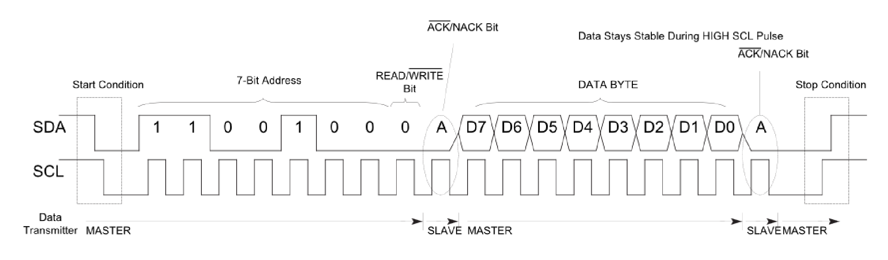
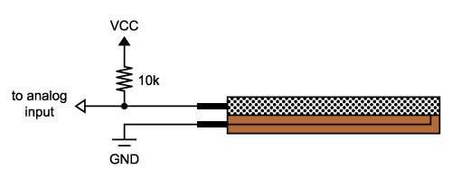
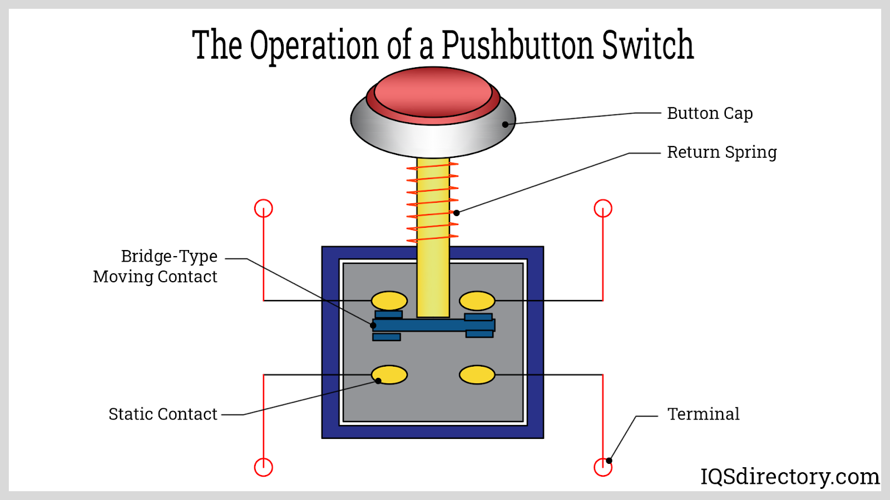

# Knee Rehabilitation Device
I am building a knee rehabilitation device. The device tracks squat form and tells the user if they are making common errors with squatting like their knees bending inwards. To do this, I use a flex sensor and accelerometer to track the movement and bend of the user's knee. I then use a Bluetooth monitor to wirelessly send the data from my Arduino microcontroller to a computer where the data is processed. The computer then prints out a message corresponding to the user's squat form.

| **Engineer** | **School** | **Area of Interest** | **Grade** |
|:--:|:--:|:--:|:--:|
| Keegan B | Carlmont HS | Electrical Engineering | Incoming Senior


<!---


  
# Final Milestone

##Video

##Description

##Code

##Conculsion

<iframe width="560" height="315" src="https://www.youtube.com/embed/F7M7imOVGug" title="YouTube video player" frameborder="0" allow="accelerometer; autoplay; clipboard-write; encrypted-media; gyroscope; picture-in-picture; web-share" allowfullscreen></iframe>

For your final milestone, explain the outcome of your project. Key details to include are:
- What you've accomplished since your previous milestone
- What your biggest challenges and triumphs were at BSE
- A summary of key topics you learned about
- What you hope to learn in the future after everything you've learned at BSE

------->

# Second Milestone


## Video

<iframe width="560" height="315" src="https://www.youtube.com/embed/GuM8eHaUBX8?si=aFfjiZl_iG6YPFli" title="YouTube video player" frameborder="0" allow="accelerometer; autoplay; clipboard-write; encrypted-media; gyroscope; picture-in-picture; web-share" referrerpolicy="strict-origin-when-cross-origin" allowfullscreen></iframe>

## Description

In my second milestone, I used my Arduino to differentiate between good and bad squat forms and play a tone on a piezo buzzer to notify the user if they have incorrect squat form. I split this process into three main steps: wiring the accelerometer, attaching all components to the knee sleeve, and using data from the sensors to determine good and bad squat forms.

My first step for this milestone was connecting my accelerometer. I used the Adafruit LSM6DS3TR-C + LIS3MDL accelerometer and gyroscope, as well as a STEMMA QT connector. I attached the red wire to the 5V pin, the black wire to a GND pin, the yellow wire to the SCL (Serial Clock Line) pin, and the blue wire to the SDA (Serial DAta line) pin. The module powers itself using the 5V and GND pins and transfers data using the SCL and SDA pins. The module uses I2C protocol to transfer data, so the SCL pin acts as a clock, with pulses from the Arduino at a regular level, and the SDA pin transfers one bit of data accordingly to the rising edge of the clock. The Arduino creates pulses for the clock by alternating voltage between 5V and 0V, giving the device a regular signal. After connecting the accelerometer to the Arduino, I had to download the libraries for the accelerometer and gyroscope. These libraries had example code that I used to Serial print the data from the accelerometer and gyroscope.


<table>
  <tr>
    <td>Fingure 1: Above is a schematic picturing what a byte transfer to data looks like. Each bit of data on the SDA line is sent on the rising edge of the clock provided by the SCL line. The master device, in my case the Arduino microcontroller, first identifies the peripheral intended to receive the data using a 7-bit address. The peripheral with the correct address then uses the read/write bit to determine whether it is intended to read or write and sends a confirmation bit to the master device. Finally, the master device sends back the byte of data it wants to transfer. This byte is followed by a confirmation bit from the slave as well as a stop condition. Reference Analog Devices (see I2C reference at bottom).</td>
  </tr>
</table>

The next step was attaching all of the components to the knee sleeve. I first soldered the flex sensor, accelerometer, Bluetooth module, and piezo buzzer to a proto shield to ensure a strong connection betweeen components. However, after some testing, I had to move the accelerometer to both fix mechanical errors that its position caused and make it easier to determine good vs bad squat form. These wiring errors were caused by too many wires next to each other creating magnetic fields and interference patterns that distorted the current flowing through the wires. This error was making parts work inconsistently and moving the accelerometer greatly increased how consistently the parts worked. I then had to sew all of the components to the knee brace. Depending on the component, I either sewed the component straight onto the knee brace (ex. the accelerometer) or used neoprene fabric to create a pocket for the components to rest in (ex. the flex sensor and Arduino).

My final step was to use data from the accelerometer and flex sensor to differentiate between good and bad squat form. I initially found this process to be very difficult because of inconsistency with the acceleration values when performing different squat errors. After some time, I decided to move the accelerometer to a location closer to the kneecap because the movements of the user bending their knees over their toes or bending their knees inward were more dramatic. After moving the accelerometer, it was surprisingly easy to find values for different errors in the user's squat. These errors were mainly visible in the y-acceleration and z-acceleration values. Using the sensor values, I created an if-conditional to Serial print a message notifying the user of the error with the squat and play a tone on a piezo buzzer to give them immediate feedback if they had bad form.


<table>
  <tr>
    <td>Figure 2: Above is a graph picturing the data from the flex sensor and accelerometer during a squat with good form and a squat where the knees bend inwards. The squat with knees bending inwards has lower y-acceleration and z-acceleration values during the squat.</td>
  </tr>
</table>


<table>
  <tr>
    <td>Figure 3: The second graph illustrates the data from the accelerometer alone. This graph highlights the differences in y-acceleration and z-acceleration values during the squat.</td>
  </tr>
</table>

## Code

```c++
// SPDX-FileCopyrightText: 2020 Kattni Rembor for Adafruit Industries
//
// SPDX-License-Identifier: MIT

//Accel: X(), Y(), Z (up +, down -)
//Gyro: X(), Y(), Z(Counterclockwise +, Clockwise -)


//Imports for Accelerometer/Gyroscope
#include <Adafruit_LSM6DS3TRC.h>
Adafruit_LSM6DS3TRC lsm6ds;

#include <Adafruit_LIS3MDL.h>
Adafruit_LIS3MDL lis3mdl;

//Tickers
#include "Ticker.h"
void getAccelerometerData();
void getFlexSensorData();
Ticker accelerometer(getAccelerometerData,200,0);
Ticker flexSensor(getFlexSensorData,200,0);


//Instance Vars for Flex Sensor
const float VCC = 5.08; // Measured voltage of Ardunio 5V line
const float R_DIV = 47500.0; // Measured resistance of 3.3k resistor

const float STRAIGHT_RESISTANCE = 29000.0; // resistance when straight
const float BEND_RESISTANCE = 15000.0; // resistance at 90 deg

float angle;

//Instance Vars for Accelerometer
float xAccel;
float yAccel;
float zAccel;

float xGyro;
float yGyro;
float zGyro;

const int buzzer = 9; //buzzer to arduino pin 9

void setup(void) {
  Serial.begin(9600); //set baud rate

 //Pieze buzzer setup
  pinMode(buzzer,OUTPUT);

 //Flex Sensor setup
  pinMode(0,INPUT); //flex sensor connected to analog 0
  analogReference(DEFAULT);

 //Start Tickers
  accelerometer.start();
  flexSensor.start();

  while (!Serial)
    delay(10); // will pause Arduino Uno until serial console opens
  Serial.println("Adafruit LSM6DS+LIS3MDL test!");

  bool lsm6ds_success, lis3mdl_success;

  // hardware I2C mode, can pass in address & alt Wire

  lsm6ds_success = lsm6ds.begin_I2C();
  lis3mdl_success = lis3mdl.begin_I2C();

  if (!lsm6ds_success){
    Serial.println("Failed to find LSM6DS chip");
  }
  if (!lis3mdl_success){
    Serial.println("Failed to find LIS3MDL chip");
  }
  if (!(lsm6ds_success && lis3mdl_success)) {
    while (1) {
      delay(10);
    }
  }

  Serial.println("LSM6DS and LIS3MDL Found!");

}

void loop() {
 //Accelerometer Data Update
  accelerometer.update();

 //Flex Sensor update
  flexSensor.update();

  bool hasSquated = false;
  bool isBadForm = false;
 //Set squat form
 if(angle > 45) //Check if squat detected
 {
  hasSquated = true;
  isBadForm = false;
  if(angle > 60.0 && yAccel < -3) //Checks if knees bending inwards
  {
    Serial.println("Knees bending inwards");
    tone(buzzer,440,100); //Play buzzer sound
    isBadForm = true;
    delay(1000);
  }
  else //Good squat form
  {
    noTone(buzzer); //Stop any buzzer sound
  }
  delay(100); //Delay inbetween squats
 }
 if(!isBadForm && hasSquated)
  {
    Serial.println("Good form!");
  }
}

void getAccelerometerData()
{
  sensors_event_t accel, gyro, mag, temp;

  // Get new normalized sensor events
  lsm6ds.getEvent(&accel, &gyro, &temp);
  lis3mdl.getEvent(&mag);

  // serial plotter friendly format
  xAccel = accel.acceleration.x;
  yAccel = accel.acceleration.y;
  zAccel = accel.acceleration.z;

  xGyro = gyro.gyro.x;
  yGyro = gyro.gyro.y;
  zGyro = gyro.gyro.z;

  delayMicroseconds(10000);
}

void getFlexSensorData()
{
  //Use Voltage from Arduino to calculate the flex sensor's
  //resistance:
  int flexADC = analogRead(0);
  float flexV = flexADC * VCC / 1023.0; //Voltage
  float flexR = R_DIV * (VCC / flexV - 1.0); //Sensor resitance
  
  // Use the calculated & print resistance to estimate the
  // sensor's bend angle:
  angle = map(flexR, STRAIGHT_RESISTANCE, BEND_RESISTANCE, 0, 90.0);
  Serial.print(String(angle));
  Serial.println();
  
  Serial.flush();
}
```

## Conclusion

My main challenges during this milestone were getting my accelerometer to work consistently and correlating the data from the accelerometer and flex sensor with squat form. It was difficult to diagnose the error with my accelerometer because from a strictly electrical and software perspective, everything should have worked. It was not until after resoldering the accelerometer and double-checking its connection that I learned that the accelerometer's consistency problem was likely due to the magnetic fields that the current-carrying wires created. Luckily after diagnosing this error, I was quickly able to solve it by going back to using a STEMMA QT connecter with the accelerometer. My other main challenge was correlating data to the user's squat form. Origionally, this issue was caused by bad placement of the accelerometer combined with over-specific data collection. I resolved this error by moving the accelerometer further away from the other components on the knee brace.
My final step will be getting my Bluetooth module to work consistently and send data from the Arduino to my computer.


# First Milestone


## Video

<iframe width="560" height="315" src="https://www.youtube.com/embed/NqB88JJ7OZw?si=pWSTcFpjpKxXQiIK" title="YouTube video player" frameborder="0" allow="accelerometer; autoplay; clipboard-write; encrypted-media; gyroscope; picture-in-picture; web-share" referrerpolicy="strict-origin-when-cross-origin" allowfullscreen></iframe>

## Description

My first step was to use a flex sensor to track how many degrees the knee bends. Since Arduinos measure voltage and not resistance, I had to create a voltage divider circuit. The voltage divider formula is: V out = Z2 / (Z1 + Z2) * V in. Using this formula, I was able to calculate the resistance of the flex sensor because V in and Z1 are constants, so Z2 and V out are directly proportional to each other.
 

<table>
  <tr>
    <td>Figure 1: Above is a schematic of the voltage divider circuit for the flex sensor. Reference Synthiam.com</td>
  </tr>
</table>

My next step was to correlate this voltage drop with the degree at which the flex sensor was bent. At first, I thought to measure the resistance at certain angles and correlate the data to find the bend angle. However, after some research, I found code on the flex sensor manufacturer's website that automatically correlates the resistance of the flex sensor with the angle at which it is bent. Currently, when I bend the flex sensor, I use Serial.print() to print the data to the visible serial port. of the resistance of the flex sensor and the corresponding angle at which the sensor is bent. While the angle that the code finds is still not perfectly accurate, I plan to recalibrate the software after I attach the flex sensor to the knee brace. 

I also hooked up an HC-05 Bluetooth module to wirelessly receive data from the Arduino. Bluetooth uses ultra-high frequency radio waves, propagating at about 2.4 gigahertz, to wirelessly send data from one device to another. Waves at this frequency are short-range radio waves, so Bluetooth had a limited range of about 10 meters. 

Wiring the Bluetooth module is pretty simple, with only four direct cables needed. I attached the VCC pin with the 3.3V power from the Arduino, connected the ground pin on the module with a ground pin on the Arduino, the RX pin on the module with the TX pin on the Arduino (pin 1), and the TX pin on the module with the RX pin on the Arduino (pin 0). Initially, I was confused about why it was necessary to connect the RX and TX pins to their opposite, but after some brief research I found that RX and TX are abbreviations for receive and transmit, so what one device transmits, the other receives. After connecting the Arduino to power, the HC-05 Bluetooth module became discoverable for my computer and I was able to connect to it by entering the default pin '1234'. I then paired the module with my computer and was able to use the module as an input device by selecting Tools > Inputs > DSD HC-05 on the Arduino IDE software. Since I used the Bluetooth module as an input source, I did not need any code for the module to work and send information to my computer.

## Code

```c++
const float VCC = 4.98; // Measured voltage of Ardunio 5V line
const float R_DIV = 47500.0; // Measured resistance of 3.3k resistor

const float STRAIGHT_RESISTANCE = 37300.0; // resistance when straight
const float BEND_RESISTANCE = 90000.0; // resistance at 90 deg

void setup()
{
  Serial.begin(9600);
  pinMode(0,INPUT); //flex sensor connected to analog 0
  analogReference(DEFAULT);
}

void loop()
{
  int flexADC = analogRead(0);
  float flexV = flexADC * VCC / 1023.0;
  float flexR = R_DIV * (VCC / flexV - 1.0);
  Serial.println("Resistance: " + String(flexR) + " ohms");
  
  // Use the calculated resistance to estimate the sensor's
  // bend angle:
  float angle = map(flexR, STRAIGHT_RESISTANCE, BEND_RESISTANCE, 0, 90.0);
  Serial.println("Bend: " + String(angle) + " degrees");
  Serial.println();
  
  Serial.flush();
  
  delay(500);//delay of 0.5 seconds
}
```

## Conclusion

The main challenge I faced while completing my first milestone was getting the Bluetooth module to work. I got the module working and sending data to my computer a few times, but it was not consistent. To solve the problem, I had to do a lot of research about the device and ultimately found that my problem was mostly caused by giving the module 5V instead of 3.3V to the VCC pin. I also had to forget and re-pair the module, but after completing these steps, I was finally able to get the Bluetooth module to consistently send the data from the flex sensor to my computer.

My next steps for completing my project are getting my accelerometer and gyroscope working and connecting all of the components to the knee brace. I will then be able to wirelessly send the data from the flex sensor and gyroscope from the knee brace to my computer.


# Starter Project

## Video

<iframe width="560" height="315" src="https://www.youtube.com/embed/pxzY77Jq7yg?si=mCKrMBZ17AjBoQ9w" title="YouTube video player" frameborder="0" allow="accelerometer; autoplay; clipboard-write; encrypted-media; gyroscope; picture-in-picture; web-share" referrerpolicy="strict-origin-when-cross-origin" allowfullscreen></iframe>

## Description

  For my starter project, I chose the Bluestamp Arduino starter. I used an Arduino Uno microcontroller board. I connected a button as an input source, and a LED and a piezo buzzer as output sources. I used a breadboard to configure the electric circuits. When I click the button the light will turn on for a short time and the buzzer will play a short song. I started by getting my input source to work. The basic idea for the physical aspect of the button is that when someone presses it, the button completes a circuit. 


<table>
  <tr>
    <td>Figure 1 Above is a diagram of how a button works. In a four-pin press button, two pins are used for input and two are used for output. When the button is pressed, there is a connection established between two pairs of switches, allowing current to flow. Reference IQSdirectory.com</td>
  </tr>
</table>

I then used some code from the tutorial I followed which read whether the circuit was complete or not. I also used basic if-statement to control when the output sources are triggered. I then focused on having the LED light up when the button was pressed. I found a function that sends a current through the LED, causing it to light up. Finally, I worked on the piezo buzzer. I used code from a piezo button tutorial to send an alternating voltage through the piezo buzzer which causes the buzzer to emit sound. The code also allowed me to change the sound the buzzer produces by changing variables which store the pitch and length of the notes, and the tempo. Here is the code for the buzzer:

## Code

```c++
// Variables which store data about the song.
char notes[] = "cdfda ag cdfdg gf "; // a space represents a rest
int beats[] = {1,1,1,1,1,1,4,4,2,1,1,1,1,1,1,4,4,2};
int tempo = 113;

//Loop to produce the song.
for (i = 0; i < songLength; i++) // step through the song arrays
     {
      duration = beats[i] * tempo;  // length of note/rest in ms

      if (notes[i] == ' ')          // is this a rest?
       {
        delay(duration);            // then pause for a moment
       }
       else                          // otherwise, play the note
       {
        tone(buzzerPin, frequency(notes[i]), duration);
        delay(duration);            // wait for tone to finish
       }
       delay(tempo/10);              // brief pause between notes
     }
```

Despite easily being able to change the sound from the buzzer, I chose to keep the original song from the code because it seemed more straightforward for my project.

## Conclusion

  The major challenge that I encountered while making my starter project was connecting code between my input and output sources. This was my first time coding in C++ and so I felt a learning curve but I perservered! I already knew basic logic behind coding, so learned some basic formatting for C++ and then was able to complete my code.
  After completing the starter project, I plan to apply the information I learned about the Arduino system to my main project, the Knee Rehabilitation device, because it also uses the Arduino system. I will also use the information I learned about C++ to write code for my main project.

<!---

# Schematics 
Here's where you'll put images of your schematics. [Tinkercad](https://www.tinkercad.com/blog/official-guide-to-tinkercad-circuits) and [Fritzing](https://fritzing.org/learning/) are both great resources to create professional schematic diagrams, though BSE recommends Tinkercad becuase it can be done easily and for free in the browser. 

# Code 

## Starter Project

```c++
// constants won't change. They're used here to set pin numbers:
const int buttonPin = 2;  // the number of the pushbutton pin

// variables will change:
int buttonState = 0;  // variable for reading the pushbutton status

const int buzzerPin = 9;

// Length must equal the total number of notes and spaces 

const int songLength = 18;

// Notes is an array of text characters corresponding to the notes
// in your song. A space represents a rest (no tone)

char notes[] = "cdfda ag cdfdg gf "; // a space represents a rest

// Beats is an array of values for each note and rest.
// A "1" represents a quarter-note, 2 a half-note, etc.
// Don't forget that the rests (spaces) need a length as well.

int beats[] = {1,1,1,1,1,1,4,4,2,1,1,1,1,1,1,4,4,2};

// The tempo is how fast to play the song.
// To make the song play faster, decrease this value.

int tempo = 113;

void setup() {
  // initialize the pushbutton pin as an input:
  pinMode(buttonPin, INPUT);
  // initialize digital pin LED_BUILTIN as an output.
  pinMode(LED_BUILTIN, OUTPUT);
  // initialize digital pin buzzerPin as an output.
  pinMode(buzzerPin, OUTPUT);
}

void loop() {
  // read the state of the pushbutton value:
  buttonState = digitalRead(buttonPin);
  int i, duration;

  // check if the pushbutton is pressed. If it is, the buttonState is HIGH:
  if (buttonState == HIGH) {
    // turn LED on:
      digitalWrite(LED_BUILTIN, HIGH);
    

      for (i = 0; i < songLength; i++) // step through the song arrays
      {
       duration = beats[i] * tempo;  // length of note/rest in ms

       if (notes[i] == ' ')          // is this a rest? 
        {
         delay(duration);            // then pause for a moment
        }
        else                          // otherwise, play the note
        {
         tone(buzzerPin, frequency(notes[i]), duration);
         delay(duration);            // wait for tone to finish
        }
        delay(tempo/10);              // brief pause between notes
      }

  }

 else {
    // turn LED off:
    digitalWrite(LED_BUILTIN, LOW);   // turn the LED off by making the voltage LOW

  }
}

int frequency(char note) 
{
  // This function takes a note character (a-g), and returns the
  // corresponding frequency in Hz for the tone() function.

  int i;
  const int numNotes = 8;  // number of notes we're storing

  // The following arrays hold the note characters and their
  // corresponding frequencies. The last "C" note is uppercase
  // to separate it from the first lowercase "c".

  char names[] = { 'c', 'd', 'e', 'f', 'g', 'a', 'b', 'C' };
  int frequencies[] = {262, 294, 330, 349, 392, 440, 494, 523};

  // Now we'll search through the letters in the array, and if
  // we find it, we'll return the frequency for that note.

  for (i = 0; i < numNotes; i++)  // Step through the notes
  {
    if (names[i] == note)         // Is this the one?
    {
      return(frequencies[i]);     // Yes! Return the frequency
    }
  }
  return(0); 
}
```
-->

# Bill of Materials
Here's where you'll list the parts in your project. To add more rows, just copy and paste the example rows below.
Don't forget to place the link of where to buy each component inside the quotation marks in the corresponding row after href =. Follow the guide [here]([url](https://www.markdownguide.org/extended-syntax/)) to learn how to customize this to your project needs. 

| **Part** | **Note** | **Price** | **Link** |
|:--:|:--:|:--:|:--:|
| Elegoo Arduino Uno Rev3 | Microcontroller that tracks inputs and outputs | $16.99 | <a href="https://www.amazon.com/ELEGOO-Board-ATmega328P-ATMEGA16U2-Compliant/dp/B01EWOE0UU/ref=asc_df_B01EWOE0UU/?tag=hyprod-20&linkCode=df0&hvadid=692875362841&hvpos=&hvnetw=g&hvrand=17301129855729572728&hvpone=&hvptwo=&hvqmt=&hvdev=c&hvdvcmdl=&hvlocint=&hvlocphy=9032183&hvtargid=pla-2281435180298&psc=1&mcid=c57f122647983cf9aa5816d6ceaa305e&hvocijid=17301129855729572728-B01EWOE0UU-&hvexpln=73&gad_source=1"> Link </a> |
| DSD Tech HC-05 Bluetooth Module | Wirelessly sending and recieving data with the Arduino | $9.99 | <a href="https://www.amazon.com/DSD-TECH-HC-05-Pass-through-Communication/dp/B01G9KSAF6/ref=asc_df_B01G9KSAF6/?tag=hyprod-20&linkCode=df0&hvadid=692875362841&hvpos=&hvnetw=g&hvrand=7048237910432903615&hvpone=&hvptwo=&hvqmt=&hvdev=c&hvdvcmdl=&hvlocint=&hvlocphy=9032183&hvtargid=pla-2281435179098&psc=1&mcid=26cc2f19047436b998e7e493e31b85d1&hvocijid=7048237910432903615-B01G9KSAF6-&hvexpln=73&gad_source=1"> Link </a> |
| Flex Sensor | Outputs a variable resistance depending on how bent it is | $17.95 | <a href="https://www.sparkfun.com/products/8606"> Link </a> |
| Adafruit LSM6DS3TR-C + LIS3MDL - Precision 9 DoF IMU - STEMMA QT / Qwiic | Measure acceleration and tilt/rotation | $19.95 | <a href="https://www.adafruit.com/product/5543?gad_source=1&gclid=CjwKCAjwp4m0BhBAEiwAsdc4aF-bHH7kpOx4VBjkP3v7cGrB5z1FHOJRmlT9sgh4GUPoRjxZ_rGQ6RoCXmsQAvD_BwE"> Link </a> |
|Anker PowerCore 5,000mAh Portable Charger | Supplying power to the Arduino | $21.99 | <a href="https://www.amazon.com/Anker-PowerCore-Ultra-Compact-High-Speed-Technology/dp/B01CU1EC6Y/ref=asc_df_B01CU1EC6Y/?tag=hyprod-20&linkCode=df0&hvadid=312111908612&hvpos=&hvnetw=g&hvrand=17851029625711693156&hvpone=&hvptwo=&hvqmt=&hvdev=c&hvdvcmdl=&hvlocint=&hvlocphy=9061320&hvtargid=pla-523807968135&th=1"> Link </a> |
| Knee Compression Sleve | Holds all of the components to the user's knee | $15.99 | <a href="https://www.amazon.com/Compression-Sleeve-Support-Running-Medium/dp/B0987XYGQS/ref=sr_1_1_sspa?crid=1YPAWDY72UPC4&keywords=knee%2Bsleeve&qid=1685066084&sprefix=knee%2Bsleev%2Caps%2C182&sr=8-1-spons&spLa=ZW5jcnlwdGVkUXVhbGlmaWVyPUEzRjkzWEExWDZSMEEwJmVuY3J5cHRlZElkPUEwMDE2MDE5NjNVMTlUWTBNNUkzJmVuY3J5cHRlZEFkSWQ9QTAwNjE5MDYzTDhJTE1IWFZaRUNVJndpZGdldE5hbWU9c3BfYXRmJmFjdGlvbj1jbGlja1JlZGlyZWN0JmRvTm90TG9nQ2xpY2s9dHJ1ZQ&th=1"> Link </a> |
| Neoprene Fabric | Attaching components to the knee sleve | $16.99 | <a href="https://www.amazon.com/lychee-Neoprene-Waterproof-Wetsuit-Stretch/dp/B07MCC3968/ref=sr_1_2?crid=2PLYALBAJAEP3&keywords=neoprene+fabric&qid=1689571945&sprefix=neoprene+fabri%2Caps%2C172&sr=8-2"> Link </a> |
| Piezo Buzzer | Notify the user when they have incorrect form | $1.50 | <a href="https://www.adafruit.com/product/160"> Link </a> |
| 10k Ohm Resistor | Creating a voltage divider | $0.75 | <a href="https://www.adafruit.com/product/2784"> Link </a> |
| Wire | Connecting sensors to Arduino | $2.95 | <a href="https://www.adafruit.com/product/288"> Link </a> |
| Item Name | What the item is used for | $Price | <a href="https://www.amazon.com/Arduino-A000066-ARDUINO-UNO-R3/dp/B008GRTSV6/"> Link </a> |


# Other Resources/Examples
Here are the websites where I learned to use the components and code needed for this project:
- [Button](https://docs.arduino.cc/built-in-examples/digital/Button/)
- [LED](https://docs.arduino.cc/built-in-examples/basics/Blink/)
- [Piezo Buzzer](https://learn.sparkfun.com/tutorials/sik-experiment-guide-for-arduino---v32/experiment-11-using-a-piezo-buzzer)
- [Flex Sensor (Video)](https://www.youtube.com/watch?v=_tXWoplbqWo)
- [HC-05 Bluetooth Module (Video)](https://youtu.be/aVhjlN-sy78?si=FTf0CLcM2PmxhGN6)
- [Accelerometer](https://learn.adafruit.com/adafruit-lsm6ds3tr-c-lis3mdl-precision-9-dof-imu/arduino)
- [Ticker](https://github.com/sstaub/Ticker/tree/main)
- [I2C](https://www.analog.com/en/resources/technical-articles/i2c-primer-what-is-i2c-part-1.html)
