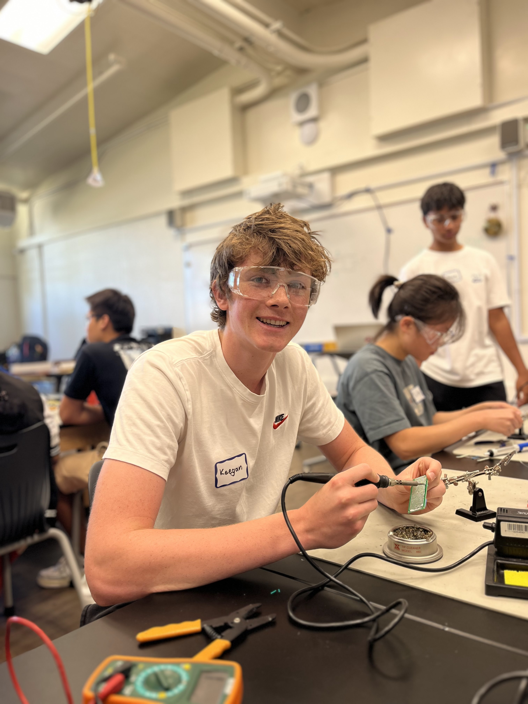

# Knee Rehabilitation Device
I am building a knee rehabilitation device. The device tracks squat form and tells the user if they are making common errors with squatting like their knees bending inwards. To do this, I use a flex sensor and accelerometer to track the movement and bend of the user's knee. I then use a Bluetooth monitor to wirelessly send the data from my Arduino microcontroller to a computer where the data is processed. The computer then prints out a message corresponding to the user's squat form.

| **Engineer** | **School** | **Area of Interest** | **Grade** |
|:--:|:--:|:--:|:--:|
| Keegan B | Carlmont HS | Electrical Engineering | Incoming Senior


<!---

**Replace the BlueStamp logo below with an image of yourself and your completed project. Follow the guide [here](https://tomcam.github.io/least-github-pages/adding-images-github-pages-site.html) if you need help.**


  
# Final Milestone

**Don't forget to replace the text below with the embedding for your milestone video. Go to Youtube, click Share -> Embed, and copy and paste the code to replace what's below.**

<iframe width="560" height="315" src="https://www.youtube.com/embed/F7M7imOVGug" title="YouTube video player" frameborder="0" allow="accelerometer; autoplay; clipboard-write; encrypted-media; gyroscope; picture-in-picture; web-share" allowfullscreen></iframe>

For your final milestone, explain the outcome of your project. Key details to include are:
- What you've accomplished since your previous milestone
- What your biggest challenges and triumphs were at BSE
- A summary of key topics you learned about
- What you hope to learn in the future after everything you've learned at BSE


# Second Milestone

**Don't forget to replace the text below with the embedding for your milestone video. Go to Youtube, click Share -> Embed, and copy and paste the code to replace what's below.**

<iframe width="560" height="315" src="https://www.youtube.com/embed/y3VAmNlER5Y" title="YouTube video player" frameborder="0" allow="accelerometer; autoplay; clipboard-write; encrypted-media; gyroscope; picture-in-picture; web-share" allowfullscreen></iframe>

For your second milestone, explain what you've worked on since your previous milestone. You can highlight:
- Technical details of what you've accomplished and how they contribute to the final goal
- What has been surprising about the project so far
- Previous challenges you faced that you overcame
- What needs to be completed before your final milestone 

# First Milestone

**Don't forget to replace the text below with the embedding for your milestone video. Go to Youtube, click Share -> Embed, and copy and paste the code to replace what's below.**

<iframe width="560" height="315" src="https://www.youtube.com/embed/CaCazFBhYKs" title="YouTube video player" frameborder="0" allow="accelerometer; autoplay; clipboard-write; encrypted-media; gyroscope; picture-in-picture; web-share" allowfullscreen></iframe>

For your first milestone, describe what your project is and how you plan to build it. You can include:
- An explanation about the different components of your project and how they will all integrate together
- Technical progress you've made so far
- Challenges you're facing and solving in your future milestones
- What your plan is to complete your project

--->

# Starter Project

## Video

<iframe width="560" height="315" src="https://www.youtube.com/embed/pxzY77Jq7yg?si=mCKrMBZ17AjBoQ9w" title="YouTube video player" frameborder="0" allow="accelerometer; autoplay; clipboard-write; encrypted-media; gyroscope; picture-in-picture; web-share" referrerpolicy="strict-origin-when-cross-origin" allowfullscreen></iframe>

## Description

  For my starter project, I chose the Bluestamp Arduino starter. I used an Arduino Uno microcontroller board. I connected a button as an input source, and a LED and a piezo buzzer as output sources. I used a breadboard to configure the electric circuits. When I click the button the light will turn on for a short time and the buzzer will play a short song. I started by getting my input source to work. The basic idea for the physical aspect of the button is that when someone presses it, the button completes a circuit. 

|:--:| 
|Above is a diagram of how a button works. In a four-pin press button, two pins are used for input and two are used for output. When the button is pressed, there is a connection established between two pairs of switches, allowing current to flow. Reference ArduinoGetStarted.com|

I then used some code from the tutorial I followed which read whether the circuit was complete or not. I also used basic if-statement to control when the output sources are triggered. I then focused on having the LED light up when the button was pressed. I found a function that sends a current through the LED, causing it to light up. Finally, I worked on the piezo buzzer. I used code from a piezo button tutorial to send an alternating voltage through the piezo buzzer which causes the buzzer to emit sound. The code also allowed me to change the sound the buzzer produces by changing variables which store the pitch and length of the notes, and the tempo. Here is the code for the buzzer:

## Code

```c++
// Variables which store data about the song.
char notes[] = "cdfda ag cdfdg gf "; // a space represents a rest
int beats[] = {1,1,1,1,1,1,4,4,2,1,1,1,1,1,1,4,4,2};
int tempo = 113;

//Loop to produce the song.
for (i = 0; i < songLength; i++) // step through the song arrays
     {
      duration = beats[i] * tempo;  // length of note/rest in ms

      if (notes[i] == ' ')          // is this a rest?
       {
        delay(duration);            // then pause for a moment
       }
       else                          // otherwise, play the note
       {
        tone(buzzerPin, frequency(notes[i]), duration);
        delay(duration);            // wait for tone to finish
       }
       delay(tempo/10);              // brief pause between notes
     }
```

Despite easily being able to change the sound from the buzzer, I chose to keep the original song from the code because it seemed more straightforward for my project.

## Conclusion

  The major challenge that I encountered while making my starter project was connecting code between my input and output sources. This was my first time coding in C++ and so I felt a learning curve but I perservered! I already knew basic logic behind coding, so learned some basic formatting for C++ and then was able to complete my code.
  After completing the starter project, I plan to apply the information I learned about the Arduino system to my main project, the Knee Rehabilitation device, because it also uses the Arduino system. I will also use the information I learned about C++ to write code for my main project.

<!---

# Schematics 
Here's where you'll put images of your schematics. [Tinkercad](https://www.tinkercad.com/blog/official-guide-to-tinkercad-circuits) and [Fritzing](https://fritzing.org/learning/) are both great resources to create professional schematic diagrams, though BSE recommends Tinkercad becuase it can be done easily and for free in the browser. 

# Code 

## Starter Project

```c++
// constants won't change. They're used here to set pin numbers:
const int buttonPin = 2;  // the number of the pushbutton pin

// variables will change:
int buttonState = 0;  // variable for reading the pushbutton status

const int buzzerPin = 9;

// Length must equal the total number of notes and spaces 

const int songLength = 18;

// Notes is an array of text characters corresponding to the notes
// in your song. A space represents a rest (no tone)

char notes[] = "cdfda ag cdfdg gf "; // a space represents a rest

// Beats is an array of values for each note and rest.
// A "1" represents a quarter-note, 2 a half-note, etc.
// Don't forget that the rests (spaces) need a length as well.

int beats[] = {1,1,1,1,1,1,4,4,2,1,1,1,1,1,1,4,4,2};

// The tempo is how fast to play the song.
// To make the song play faster, decrease this value.

int tempo = 113;

void setup() {
  // initialize the pushbutton pin as an input:
  pinMode(buttonPin, INPUT);
  // initialize digital pin LED_BUILTIN as an output.
  pinMode(LED_BUILTIN, OUTPUT);
  // initialize digital pin buzzerPin as an output.
  pinMode(buzzerPin, OUTPUT);
}

void loop() {
  // read the state of the pushbutton value:
  buttonState = digitalRead(buttonPin);
  int i, duration;

  // check if the pushbutton is pressed. If it is, the buttonState is HIGH:
  if (buttonState == HIGH) {
    // turn LED on:
      digitalWrite(LED_BUILTIN, HIGH);
    

      for (i = 0; i < songLength; i++) // step through the song arrays
      {
       duration = beats[i] * tempo;  // length of note/rest in ms

       if (notes[i] == ' ')          // is this a rest? 
        {
         delay(duration);            // then pause for a moment
        }
        else                          // otherwise, play the note
        {
         tone(buzzerPin, frequency(notes[i]), duration);
         delay(duration);            // wait for tone to finish
        }
        delay(tempo/10);              // brief pause between notes
      }

  }

 else {
    // turn LED off:
    digitalWrite(LED_BUILTIN, LOW);   // turn the LED off by making the voltage LOW

  }
}

int frequency(char note) 
{
  // This function takes a note character (a-g), and returns the
  // corresponding frequency in Hz for the tone() function.

  int i;
  const int numNotes = 8;  // number of notes we're storing

  // The following arrays hold the note characters and their
  // corresponding frequencies. The last "C" note is uppercase
  // to separate it from the first lowercase "c".

  char names[] = { 'c', 'd', 'e', 'f', 'g', 'a', 'b', 'C' };
  int frequencies[] = {262, 294, 330, 349, 392, 440, 494, 523};

  // Now we'll search through the letters in the array, and if
  // we find it, we'll return the frequency for that note.

  for (i = 0; i < numNotes; i++)  // Step through the notes
  {
    if (names[i] == note)         // Is this the one?
    {
      return(frequencies[i]);     // Yes! Return the frequency
    }
  }
  return(0); 
}
```

# Bill of Materials
Here's where you'll list the parts in your project. To add more rows, just copy and paste the example rows below.
Don't forget to place the link of where to buy each component inside the quotation marks in the corresponding row after href =. Follow the guide [here]([url](https://www.markdownguide.org/extended-syntax/)) to learn how to customize this to your project needs. 

| **Part** | **Note** | **Price** | **Link** |
|:--:|:--:|:--:|:--:|
| Item Name | What the item is used for | $Price | <a href="https://www.amazon.com/Arduino-A000066-ARDUINO-UNO-R3/dp/B008GRTSV6/"> Link </a> |
| Item Name | What the item is used for | $Price | <a href="https://www.amazon.com/Arduino-A000066-ARDUINO-UNO-R3/dp/B008GRTSV6/"> Link </a> |
| Item Name | What the item is used for | $Price | <a href="https://www.amazon.com/Arduino-A000066-ARDUINO-UNO-R3/dp/B008GRTSV6/"> Link </a> |

--->

# Other Resources/Examples
Here are the websites where I learned to use the components and code needed for this project:
- [Button](https://docs.arduino.cc/built-in-examples/digital/Button/)
- [LED](https://docs.arduino.cc/built-in-examples/basics/Blink/)
- [Piezo Buzzer](https://learn.sparkfun.com/tutorials/sik-experiment-guide-for-arduino---v32/experiment-11-using-a-piezo-buzzer)

<!--- To watch the BSE tutorial on how to create a portfolio, click here. --->
